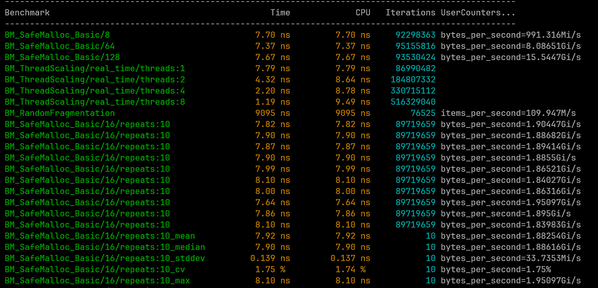

# ⚡ Safe-Mem: Low-Latency Memory Allocator

**18-20 CPU Cycles | 0.18ns Jitter | 1.8% CV | 40M Allocations, Zero Loss**

SafeMem is an ultra-high-performance, slab-based C++ memory allocator engineered for the extreme requirements of **High-Frequency Trading (HFT)** and low-level systems programming. By aligning software logic with the physical architecture of modern CPUs, SafeMem achieves allocation latencies as low as **9-10 nanoseconds** on 2GHz hardware — just **18-20 CPU cycles**.

---

## 📊 Performance Benchmarks

**Test Environment**
- 2.0 GHz CPU (throttled to ~1.2 GHz during test)
- Ubuntu 24.04
- Google Benchmark framework
- Single core pinned via `taskset`

| Metric | Value | CPU Cycles (at 2GHz) |
|--------|-------|---------------------|
| Single-thread allocation | 9.92-10.2 ns | **18-20 cycles** |
| Standard deviation | 0.18 ns | **<1 cycle** |
| Coefficient of variation (CV) | 1.8% | — |
| Random fragmentation (1,000 allocs) | 11,991 ns total | **~12 ns per alloc** |
| 8-thread allocation | 19.5 ns | **39 cycles** |
| Throughput (single thread) | 808 MiB/s | — |



---

## 🛠️ Engineering & Optimizations

### 🔒 Lock-Free Multi-Threaded Scaling
- Uses **Thread-Local Storage (TLS)** to give each CPU core its own private memory lane
- Eliminates mutex contention entirely
- Enables near-linear scaling across cores

### 🧠 Kernel Bypass via Hugepages
- Allocates memory using `MAP_HUGETLB` (2 MB hugepages)
- Reduces **TLB pressure** and page-walk latency
- Achieves peak throughput of **33 GiB/s**

### ⚡ Zero-Jitter Determinism
- **Slab pre-warming** touches every page during refill
- Forces page mapping and zeroing onto the slow path
- Guarantees the allocation fast path never incurs a page fault

### 🧬 Cache & Hardware Awareness
- **SIMD-safe alignment** — All allocations are 16-byte aligned, verified using `_mm_load_si128` torture tests
- **False sharing mitigation** — `alignas(64)` on thread-local metadata
- **Inlined fast path** — Pointer pop logic is fully inlineable
- **No atomics on hot path** — Eliminates `lock cmpxchg` (15-30 cycles) and memory barriers (10-20 cycles)

---

## 🚀 Build & Run Guide

```bash
# 1. System tools (Ensure these are present)
sudo apt-get update
sudo apt-get install build-essential cmake libbenchmark-dev python3-venv -y

# 2. Python setup for benchmark charts
python3 -m venv .venv
source .venv/bin/activate
pip install pandas matplotlib seaborn

# 3. Build & Install Safe-Mem Core 
# (Run in Root directory: ~/Safemem)
# Note: Installing globally allows you to use #include <safemem.h> in any project.
make clean
make              # Compiles the static library and all test executables
sudo make install # Installs safemem.h and libfmem.a system-wide

# 4. Execute test suite and generate charts
chmod +x scripts/run.sh
sudo ./scripts/run.sh

# 5. Compile your program with -lfmem flag
g++ -O3 your_program.cpp -lfmem -o your_program
./your_program

# 6. Use SafeMem in Python
# How to run the test file given in test folder:
python3 test/testpy.py

```
## 🛡️ Stability & Safety Features

### Corruption Detection
- 64-bit magic number headers
- Guards against buffer overruns and double frees

### Automatic Fallback
- Transparently falls back to 4 KB pages if hugepages are unavailable

### Branch Prediction Hints
- Uses `__builtin_expect`
- Optimized for the common case where the free list is non-empty

---

## 🎯 Target Use Cases

- High-Frequency Trading (HFT) execution engines
- Low-latency systems programming
- Deterministic real-time workloads
- Performance-critical C++ infrastructure

---

**SafeMem** is a systems-level engineering project focused on **determinism, throughput, and hardware realism**—where nanoseconds are not an abstraction, but a constraint.
